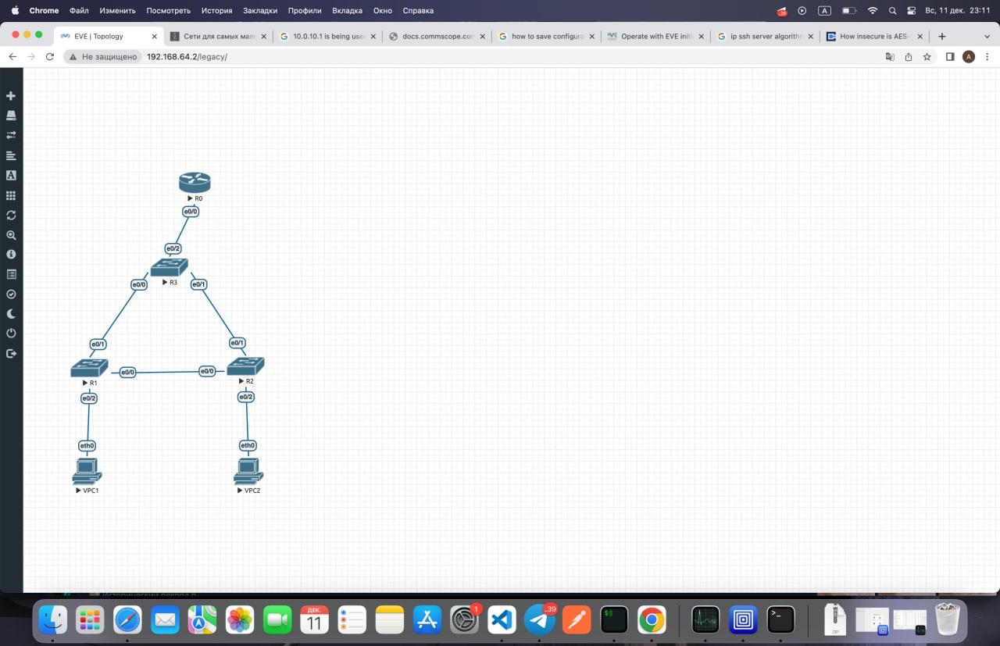
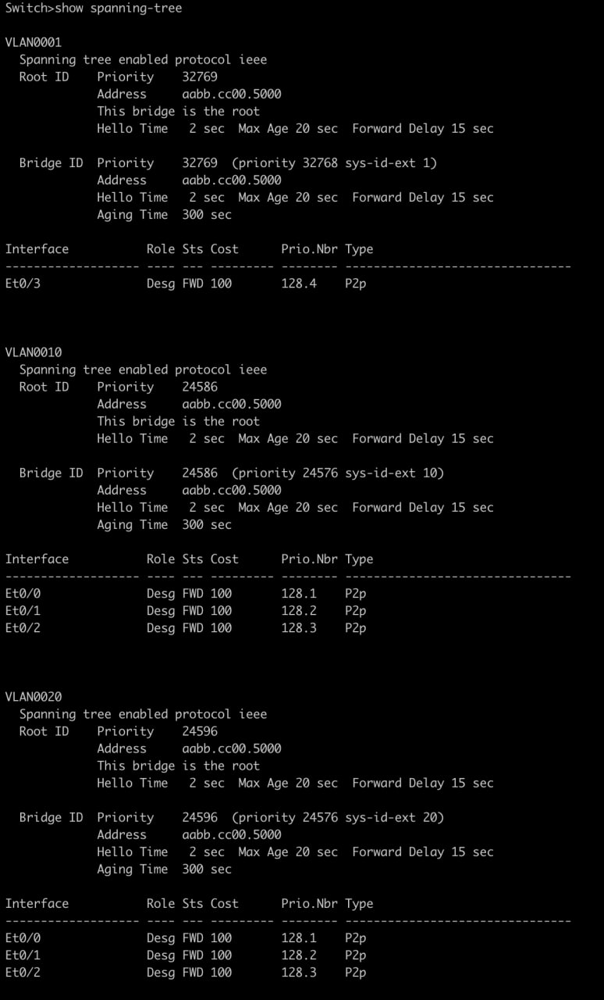
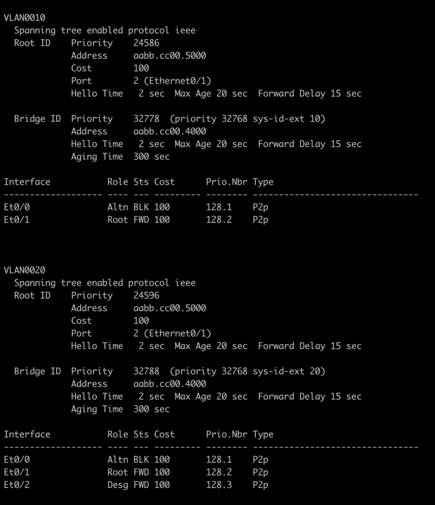
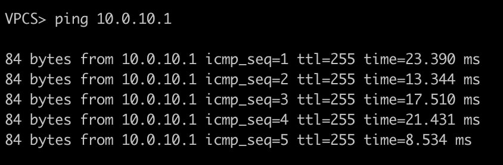
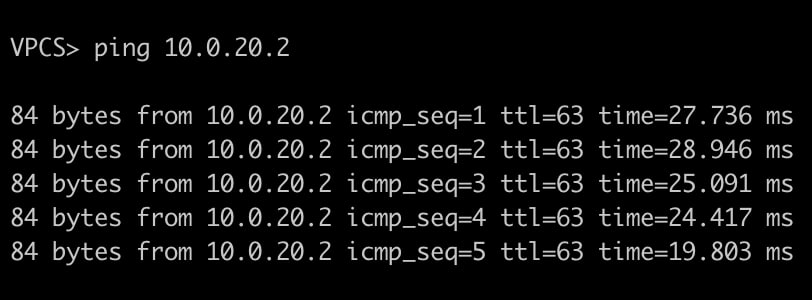
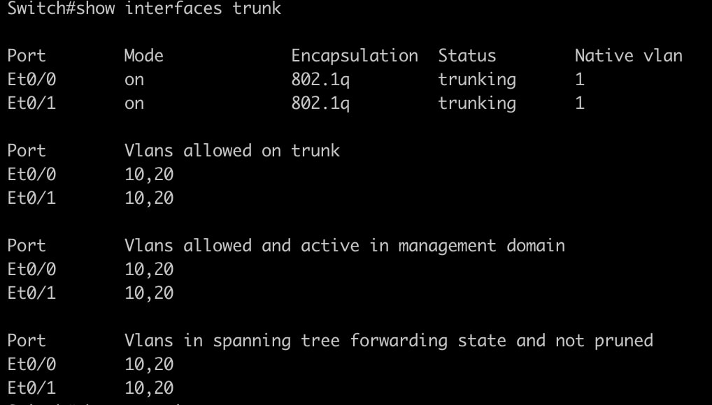

## Схема

## Коммутатор распределения - корень

## Линк между коммутаторами доступа заблокирован

## Пинги

## Интерфейс коммутатора R1

## Конфиги и лаба

Конфиги с стартовой настройкой лежат в папке configs, вся лаба - в lab
